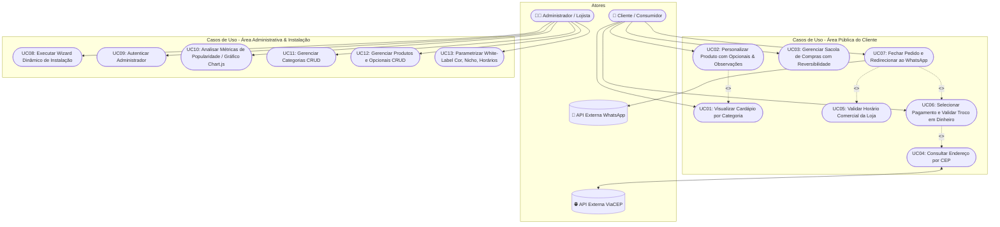
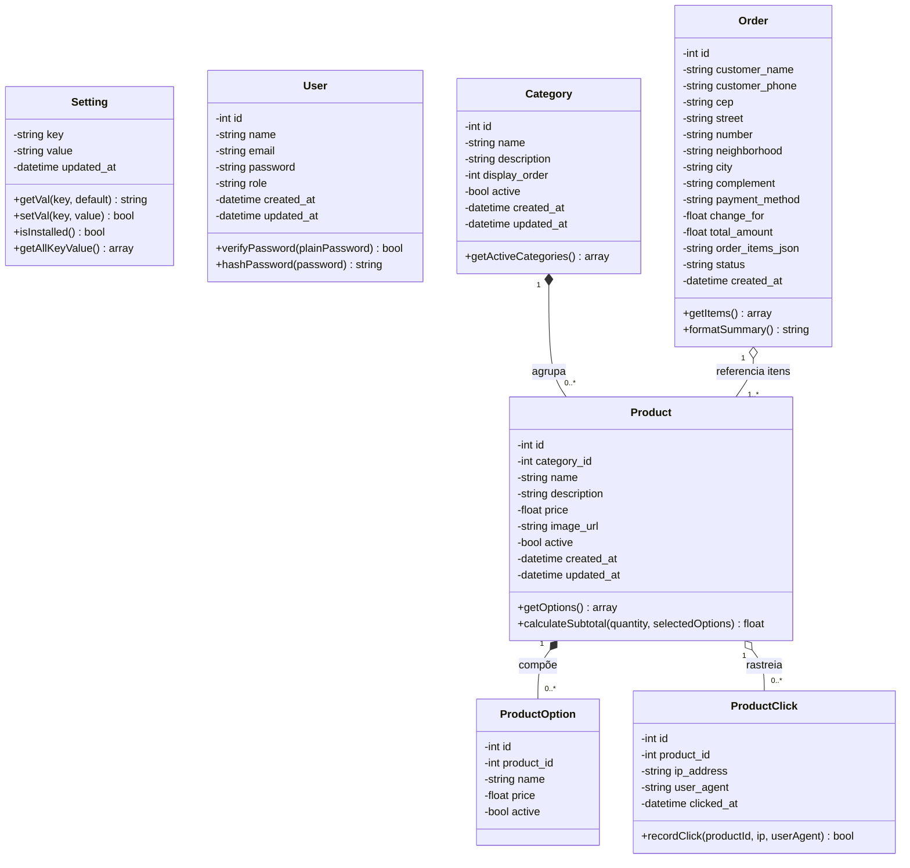
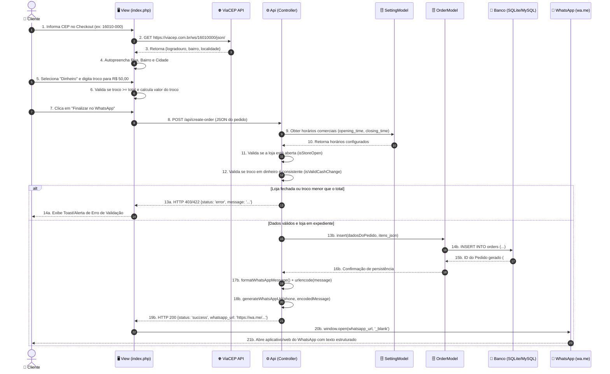
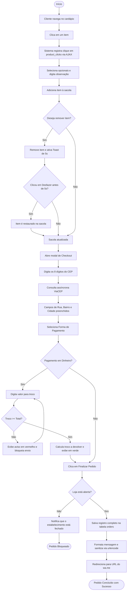

# 📐 Modelagem UML - Plataforma de Pedidos White-Label (PIT II)

> **Documento de Engenharia de Software:** Especificação de requisitos e modelagem estrutural e comportamental da aplicação em conformidade com as diretrizes do Projeto Integrador Transdisciplinar em Engenharia de Software II (Cruzeiro do Sul Virtual).

---

## 1. Diagrama de Casos de Uso (Use Case Diagram)

O diagrama abaixo especifica os atores envolvidos e as interações funcionais suportadas pela solução, destacando relações de inclusão (`<<include>>`) e extensão (`<<extend>>`).

```mermaid
usecaseDiagram
```
### Visualização em Mermaid:



---

## 2. Diagrama de Classes de Domínio e Persistência (Class Diagram)

Representa a estrutura orientada a objetos da aplicação no padrão MVC, com seus atributos tipados, métodos principais e a integridade referencial com cardinalidades.



---

## 3. Diagrama de Sequência: Processo de Realização de Pedido

Mapeia o ciclo de vida completo de uma requisição de fechamento de pedido no padrão MVC, demonstrando a troca de mensagens síncronas/assíncronas entre os objetos, validações de negócio e integração com APIs externas.



---

## 4. Diagrama de Atividades: Fluxo de Checkout e Tolerância a Falhas

Ilustra as bifurcações de decisão e o fluxo comportamental de execução com base nas regras de negócio e de IHC.


